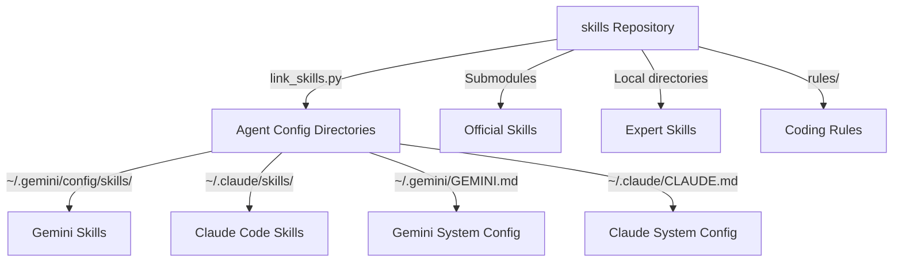

# Agent Skills Monorepo

[](https://github.com/JosephSanjaya/skills/actions)
[](https://github.com/JosephSanjaya/skills/releases)
[](LICENSE)

> Manage, optimize, and link custom capabilities (skills) and coding rules to your Artificial Intelligence (AI) coding agents.

## Table of Contents
- [About](#about)
- [Features](#features)
- [Tech Stack](#tech-stack)
- [Architecture](#architecture)
- [Project Structure](#project-structure)
- [Prerequisites](#prerequisites)
- [Setup](#setup)
- [Configuration](#configuration)
- [Usage](#usage)
- [Troubleshooting](#troubleshooting)
- [Security](#security)
- [Contributing](#contributing)
- [Roadmap](#roadmap)
- [License](#license)

## About
AI coding agents use specialized system instructions called skills to perform complex development tasks. This repository aggregates official skills from android, Kotlin, Anthropic, and skydoves as submodules. It also provides bespoke expert-level skills and injects standardized development rules into agent system configuration files.

## Features
- **Multi-Agent Integration**: Installs skills for Claude Code, Gemini, Antigravity, Kilocode, Opencode, Qwencode, AionUi, and Kiro.
- **Submodule Aggregation**: Synchronizes official developer guidelines automatically.
- **Rule Propagation**: Injects Kotlin development and readability guidelines into agent configurations.
- **Configuration Cleanup**: Removes active symlinks and rules blocks when resetting the environment.
- **Safe Evaluation**: Includes dry-run verification mode to test changes before writing them to disk.

## Tech Stack
- **Language**: Python 3.8+ (for symlink orchestration and rules injection)
- **Scripting**: Bash 4.x / Windows Batch (wrapper scripts for cross-platform execution)
- **Version Control**: Git 2.0+ (submodule dependency tracking)

## Architecture
The installer reads local files and propagates them to target agent global directories.



## Project Structure
- `android-official-skills/`: Submodule containing official Android developer skills.
- `compose-performance-skills/`: Submodule containing Compose performance optimization guidelines.
- `anthropics-skills/`: Submodule containing Anthropic prompt templates.
- `kotlin-official-skills/`: Submodule containing official Kotlin developer skills.
- `rules/`: Shared development guidelines.
  - `code-structure-patterns.md`: Guidelines for Kotlin naming, variable lifespans, and error handling.
  - `readable-code-principles.md`: Guidelines for variable naming, function size limits, and comments.
- `link_skills.py`: Core installation logic.
- `install.sh` / `install.bat`: Wrapper scripts to run the installation on macOS, Linux, or Windows.
- `update_skills.sh` / `update_skills.bat`: Wrapper scripts to pull submodules and run the installer.

## Prerequisites
| Requirement | Minimum Version | Notes |
|-------------|----------------|-------|
| Git | 2.0+ | Required to check out and update submodules. |
| Python | 3.8+ | Required to run `link_skills.py`. |
| macOS, Linux, or Windows | - | Operating system for script execution. |

## Setup
Clone this repository and run the update script.

```bash
git clone https://github.com/JosephSanjaya/skills.git
cd skills
./update_skills.sh
```

## Configuration
Configure the installer using command-line arguments.

| Argument | Description |
|----------|-------------|
| `--dry-run` / `-d` | Show actions without writing files or making symlinks. |
| `--clean` / `-c` | Remove all generated symlinks and rule blocks from config files. |
| `--non-interactive` / `--yes` | Run without user prompts and select all active agent paths. |

## Usage
Run the following commands from the repository root:

- **Run Interactive Linker**:
  ```bash
  ./install.sh
  ```
- **Preview Changes Without Writing**:
  ```bash
  ./install.sh --dry-run
  ```
- **Install Unattended (Non-Interactive)**:
  ```bash
  ./install.sh --yes
  ```
- **Reset Environment and Clean Up Symlinks**:
  ```bash
  ./install.sh --clean
  ```

## Troubleshooting

**`Error: python3 is not installed or not in your PATH.`**
- **Cause**: Python is missing or not configured in system environment variables.
- **Fix**: Download and install Python 3.8+ from [python.org](https://www.python.org/).

**`Error: Failed to create symlink`**
- **Cause**: Windows requires Developer Mode or administrative privileges to create symbolic links.
- **Fix**: Turn on **Developer Mode** in Windows Settings, or run your command prompt as Administrator. The script will attempt to fall back to Junction points if symlinks fail.

## Security
This project manages local configuration files. Review custom instructions before adding them to ensure they contain no sensitive credentials or api keys.

## Contributing
Follow these steps to add custom skills:

1. Create a subdirectory named after your skill.
2. Create a `SKILL.md` inside that directory.
3. Add YAML frontmatter at the top:
   ```yaml
   ---
   name: your-skill-name
   description: Detailed explanation of what your skill does.
   ---
   ```
4. Define your skill guidelines under the frontmatter.
5. Run `./install.sh` to link it locally and test its behavior.

*Note on Naming*: Nested subdirectories automatically flatten. For example, `android-official-skills/jetpack-compose/adaptive` links as `android-jetpack-compose-adaptive`.

## Roadmap
- Integrate additional official agent skill repositories.
- Support automated checks for formatting constraints.
- Provide rule merging capability for IDE configuration profiles.

## License
[MIT](LICENSE) © 2026 Joseph Sanjaya
