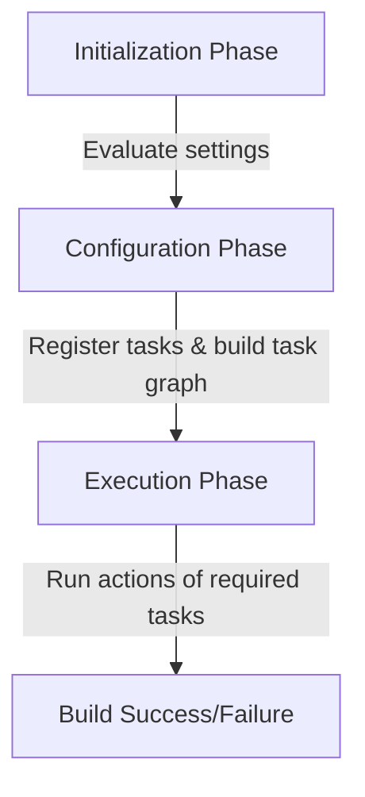

# Gradle Task Basics & Lifecycle (Gradle 9.5.1+)

## Task Lifecycle Phases

A Gradle build operates in three distinct phases:
1. **Initialization**: Determines which projects participate in the build, evaluates `settings.gradle(.kts)`.
2. **Configuration**: Evaluates `build.gradle(.kts)` scripts, registers tasks, and creates the **Task Graph**. Work inside configuration closures executes during this phase.
3. **Execution**: Evaluates the Task Graph and executes the actions (`@TaskAction`, `doFirst`, `doLast`) of tasks selected for execution.



---

## Lazy Configuration & Task Avoidance

To prevent slow builds, Gradle enforces **Task Configuration Avoidance**. Tasks should not be initialized (realized) during the configuration phase unless they are part of the execution path.

### The Eager vs. Lazy API Rules

Always use the **Lazy APIs** to register or reference tasks. Eager APIs should be migrated immediately:

| Scenario | Eager API (Smell / Slow) | Lazy API (Idiomatic / Fast) |
|---|---|---|
| **Creation** | `tasks.create("myTask")` | `tasks.register("myTask")` |
| **Lookup** | `tasks.getByName("myTask")` | `tasks.named("myTask")` |
| **Iterate All** | `tasks.all { ... }` | `tasks.configureEach { ... }` |
| **Iterate Type** | `tasks.withType(Copy::class) { ... }` | `tasks.withType<Copy>().configureEach { ... }` |

### The `TaskProvider` Concept

`tasks.register()` returns a `TaskProvider<T>`. A `TaskProvider` is a lazy handle:
- It does **not** instantiate the task class immediately.
- It instantiates the task class only when the task is requested in the execution graph, or when `.get()` is explicitly called on the provider.
- **Never** call `TaskProvider.get()` during the configuration phase. Wire tasks to each other using the Provider API (e.g., using `flatMap` or passing the provider directly to an input property).

---

## Outdated Imperative Smells

Adding task actions (`doFirst {}` / `doLast {}`) directly to eager task instances during the configuration phase is a major anti-pattern. 

### Imperative Smell 1: Eager Hooking
```kotlin
// AVOID: Realizes the task immediately to attach the action!
tasks.getByName("test").doLast {
    println("Running post-test steps")
}
```
**Correct Lazy Hooking**:
```kotlin
// PREFER: Configures the task lazily without realizing it early
tasks.named("test").configure {
    doLast {
        println("Running post-test steps")
    }
}
```

### Imperative Smell 2: Task Execution in Configuration
Executing arbitrary process/system/build work inside the configuration block of a task is a critical error.
```kotlin
// AVOID: This executes during the configuration phase, slowing down every build command!
tasks.register("generateReport") {
    val result = java.lang.ProcessBuilder("generate-report.sh").start().inputStream.readBytes()
    println(String(result))
}
```
**Correct Action Wrapping**:
```kotlin
// PREFER: Real work is placed in the task action, which only runs during Execution
tasks.register("generateReport") {
    doLast {
        val result = java.lang.ProcessBuilder("generate-report.sh").start().inputStream.readBytes()
        println(String(result))
    }
}
```

---

## Gradle 9.5.1 Task Features & Deprecations

- **`@DisableCachingByDefault` Requirement**: Custom tasks that do not declare `@CacheableTask` must be annotated with `@DisableCachingByDefault(because = "...")` to make task declaration intent explicit and avoid validation warnings.
- **Execution-time deprecations**: Running commands via the standard `Project.exec` or `Project.javaexec` APIs inside tasks is deprecated. Task actions must use injected `ExecOperations` instead.
- **Configuration Cache Enforcement**: Early resolution of configurations during the configuration phase is strictly forbidden.
